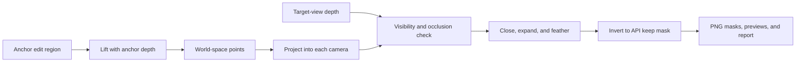

# Marble Multiview Inpainting

Local, open-source input preparation for Marble multiview inpainting.

The Marble 5 `atlasMasked` API accepts an RGB image, a grayscale keep mask, and
a camera for every view. Authoring the same edit region independently in every
view is tedious and easy to get wrong. This repository lets you mark the edit
once in an anchor view, then uses the scene's depth and cameras to project that
region into the other views.

Preparation runs locally. It does not upload images, call a hosted
preprocessing service, require an API key, or require a GPU.

> [!NOTE]
> `atlasMasked` is an access-dependent preview. Use these outputs only if the
> task appears in the API reference for your World Labs account.

## Try it

Install [`uv`](https://docs.astral.sh/uv/getting-started/installation/), then:

```bash
git clone https://github.com/worldlabsai/marble-multiview-inpainting.git
cd marble-multiview-inpainting
./marble-inpaint demo --output demo-output/
```

On the first run, `uv` creates a repository-local environment with the exact
versions in `uv.lock`. Later runs reuse it.

The demo generates a synthetic three-view RGBD scene and prepares it end to
end. It uses NumPy depth files to keep example generation fast and portable;
the normal preparation path accepts `.exr`, `.npy`, and `.npz` depth. Inspect:

```text
demo-output/prepared/previews/contact-sheet.png
```

Verify every generated file and its recorded SHA-256 hash:

```bash
./marble-inpaint inspect demo-output/prepared/
```

No package is published to PyPI. The checked-out GitHub repository is the
distribution. On Windows, replace `./marble-inpaint` with
`./marble-inpaint.ps1`.

## What it produces

Given posed RGBD views, one edited anchor image, and an anchor edit-region mask,
the tool:

1. validates the images, depths, and cameras;
2. scale-to-cover resizes and center-crops every view to 1280 x 720 while
   updating its camera intrinsics;
3. lifts valid pixels in the anchor edit region into 3D;
4. projects those points into each other camera;
5. rejects projected points that are outside the view or occluded according to
   target-view depth;
6. closes, expands, and feathers the projected fill regions;
7. converts them to the keep-mask convention expected by `atlasMasked`;
8. writes true 8-bit, single-channel grayscale PNGs; and
9. emits overlays, a contact sheet, a request template, and a detailed report.



## Mask semantics

There are two mask conventions. They are intentionally named differently.

| Mask | White (`255`) means | Black (`0`) means |
| --- | --- | --- |
| Input `edit-region.png` | This region was edited | Unchanged |
| Output `*.keep.png` | Keep the observed RGB pixel | Let Marble fill this pixel |

> [!IMPORTANT]
> Do not pass `edit-region.png` directly to the API. The generated `*.keep.png`
> files already have the correct API polarity.

The edited anchor is trusted context, so its API keep mask is entirely white.
The remaining views retain their original RGB images and receive projected
keep masks with black fill regions.

Do not pre-apply a mask to an RGB image. Upload the full RGB image and its
grayscale keep mask as separate assets.

## Prepare your own scene

Arrange the original posed RGBD views, edited anchor, and its edit mask:

```text
scene/
├── scene.json
├── rgb/
│   ├── view_00.png
│   ├── view_01.png
│   └── view_02.png
├── depth/
│   ├── view_00.exr
│   ├── view_01.exr
│   └── view_02.exr
├── edited-anchor.png
└── edit-region.png
```

Run:

```bash
./marble-inpaint prepare \
  --scene scene/scene.json \
  --anchor-view view_01 \
  --edited-anchor scene/edited-anchor.png \
  --edit-region scene/edit-region.png \
  --prompt "A low wooden bench against the stone wall" \
  --output prepared/
```

`prepare` makes no network requests. Review `prepared/previews/contact-sheet.png`
before uploading anything.

### Scene manifest

`scene.json` has one entry per view. Paths are relative to the manifest. Camera
objects use the same pinhole-camera representation as the Marble API.

```json
{
  "$schema": "https://raw.githubusercontent.com/worldlabsai/marble-multiview-inpainting/main/schemas/scene.schema.json",
  "schemaVersion": 1,
  "views": [
    {
      "id": "view_00",
      "image": "rgb/view_00.png",
      "depth": {
        "path": "depth/view_00.exr",
        "representation": "camera_z"
      },
      "camera": {
        "extrinsics": {
          "position": [0.0, 1.6, 0.0],
          "quaternion": [0.0, 0.0, 0.0, 1.0],
          "coordinateSystem": "rub"
        },
        "intrinsics": {
          "width": 1280,
          "height": 720,
          "fx": 900.0,
          "fy": 900.0,
          "cx": 640.0,
          "cy": 360.0
        }
      }
    }
  ]
}
```

Automatic projection accepts 2 to 16 well-overlapped pinhole views. Depth may
be a linear-depth `.exr`, `.npy`, or `.npz` file. Values are positive
camera-space z-depth. `NaN`, infinity, zero, and negative values are invalid.
Depth and camera translation must use the same scale, which does not have to be
metric.

The image, depth, and camera intrinsics in each input view must describe the
same pixel grid. The edited anchor and its mask must use the anchor's input
grid. The tool applies the same deterministic resize and crop to all of them.

See [the complete input specification](docs/input-format.md) for RUB/RDF axes,
EXR handling, validation, and examples. The repository also includes a
[JSON Schema](schemas/scene.schema.json) for editor completion and validation.

## Output

```text
prepared/
├── images/
│   ├── 000-view_00.png
│   ├── 001-view_01.png
│   └── 002-view_02.png
├── masks/
│   ├── 000-view_00.keep.png
│   ├── 001-view_01.keep.png
│   └── 002-view_02.keep.png
├── previews/
│   ├── contact-sheet.png
│   ├── 000-view_00.overlay.png
│   ├── 001-view_01.overlay.png
│   └── 002-view_02.overlay.png
├── prepared-scene.json
├── atlas-masked-request.template.json
└── report.json
```

- `images/` contains normalized RGB inputs. The selected anchor is the edited
  image; every other image is original context.
- `masks/` contains API-polarity keep masks as 8-bit grayscale PNGs.
- `previews/` shows the anchor edit region in cyan and generated fill regions in
  red.
- `prepared-scene.json` maps generated files to cameras.
- `atlas-masked-request.template.json` has the final request structure with
  asset-ID placeholders.
- `report.json` records the tool version, configuration, input and output
  hashes, resize transforms, per-view visibility statistics, and warnings.

The tool never silently drops a view. A region that is entirely outside a view
or fully occluded produces an all-white keep mask and an explicit report
warning. Missing or unreliable target depth fails preparation and asks for a
manual override.

### Inspect before uploading

```bash
./marble-inpaint inspect prepared/
```

Check the contact sheet for all of the following:

- The black fill region fully covers the old object in every relevant
  non-anchor view.
- The edited anchor has an all-white keep mask.
- Projected regions do not leak onto unrelated foreground objects.
- Images and masks remain pixel-aligned after normalization.
- Every output mask is an 8-bit, single-channel grayscale PNG.

### Correct one view manually

Draw a white edit-region mask for the problematic view on its original input
grid, then rerun:

```bash
./marble-inpaint prepare \
  --scene scene/scene.json \
  --anchor-view view_01 \
  --edited-anchor scene/edited-anchor.png \
  --edit-region scene/edit-region.png \
  --override-edit-region view_02=scene/view_02-edit-region.png \
  --output prepared/ \
  --overwrite
```

`--overwrite` only replaces a directory previously created by this tool. It
refuses to remove an unrecognized directory.

## Use the files with Marble

Upload each file in `images/` and `masks/` through the normal Marble asset
upload flow. Replace the placeholders in
`atlas-masked-request.template.json` with the returned asset IDs, then submit
the request to `POST /api/v2/tasks:atlasMasked`.

For every context frame:

- `imageAsset` points to its prepared RGB image;
- `maskAsset` points to the corresponding `*.keep.png` file; and
- `camera` is identical to the target camera at the same index.

See the [Marble API documentation](https://docs.worldlabs.ai/) for
authentication, uploads, task submission, operations, and the current API
contract.

## Manual-mask mode

If you do not have depth, author a white edit-region mask for every view. The
tool will still handle crop/resize, polarity conversion, PNG encoding,
validation, previews, and request templating.

Create `edit-regions.json` next to the masks:

```json
{
  "view_00": "masks/view_00-edit.png",
  "view_01": "masks/view_01-edit.png",
  "view_02": "masks/view_02-edit.png"
}
```

Then run:

```bash
./marble-inpaint prepare-manual \
  --scene scene/scene.json \
  --anchor-view view_01 \
  --edited-anchor scene/edited-anchor.png \
  --edit-regions scene/edit-regions.json \
  --output prepared/
```

Manual mode performs no geometric propagation and does not require depth paths
in `scene.json`.

## Python API

The complete pipeline and its individual stages are importable from the cloned
repository:

```python
from marble_inpainting import PrepareConfig, prepare_auto

result = prepare_auto(
    scene="scene/scene.json",
    anchor_view="view_01",
    edited_anchor="scene/edited-anchor.png",
    edit_region="scene/edit-region.png",
    output="prepared/",
    config=PrepareConfig(),
)
```

Advanced callers can inspect or replace individual stages:

```python
from marble_inpainting.geometry import lift_edit_region, project_visible_points
from marble_inpainting.masks import keep_mask_from_fill, rasterize_fill_region
```

These functions operate on ordinary NumPy arrays and documented camera types.
They do not hide model inference or remote calls.

## Configuration

Print every default:

```bash
./marble-inpaint config
```

The CLI exposes the point cap, valid-depth and visibility thresholds,
relative-depth tolerance, footprint/closing radii, mask margin, feather width,
and random seed. Every effective value is copied into `report.json`. CLI output
is fixed at the API's 1280 x 720 grid.

See [the algorithm specification](docs/algorithm.md) for exact equations and
coordinate conversions.

## Limitations

- Projection quality depends on calibrated cameras and aligned depth.
- The automatic path can propagate only surfaces with valid anchor depth.
- Large geometry changes, thin structures, reflections, transparency, moving
  objects, and very wide baselines often need manual correction.
- Original anchor depth describes the pre-edit scene. When an edit changes
  geometry substantially, projection is an approximation.
- A projected surface footprint is not a complete 3D object-volume model.
- The core package does not estimate depth, detect objects, or run a
  segmentation model.

The contact sheet is part of the preparation process, not merely a debugging
artifact. Review it before spending an API request.

## Reproducibility and privacy

- Preparation is deterministic for fixed inputs, configuration, and seed.
- `uv.lock` fixes dependency versions.
- The report records input hashes and the algorithm version.
- Preparation has no telemetry and makes no network requests.
- Inputs leave the machine only when the user separately uploads the prepared
  assets to Marble.

## Development

```bash
uv sync --frozen --all-groups
uv run pytest
uv run ruff check .
uv run pyright
```

Tests cover mask polarity, PNG encoding, EXR decoding, RDF/RUB camera
conventions, pixel-center projection, depth occlusion, crop/resize intrinsics,
deterministic sampling, the all-white anchor mask, overwrite safety, manual
mode, and the full synthetic demo.

See [CONTRIBUTING.md](CONTRIBUTING.md) before opening a pull request.

## License

[MIT](LICENSE)
